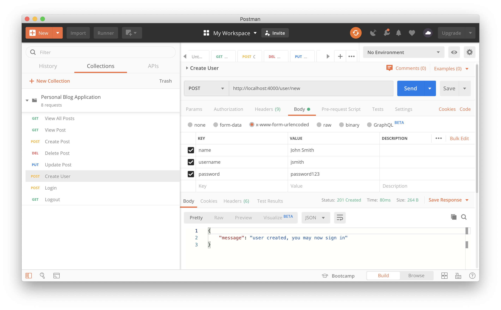

# Personal Blog Application

This project has a React front-end, bootstrapped with Create React App, and a Node.js API back-end for performing CRUD operations on a MongoDB database.

## Stack

- MongoDB
- Express
- React
- NodeJS

## How To Setup Dev Environment

```
git clone git@github.com:asnazell/blog.git
cd blog
npm install
cd client
npm install
npm run build
cd ..
npm run server
```

Both front and back end are now running on http://localhost:3000.

## API Endpoints

Please see the following [Postman Collection](postman.collection.json) for
API endpoints and payloads.



### App Functionality

- Contact me: sends emails
- Register: create user
- Login: provides an access to edir, add, delete post
- Protected routes: If user is authenticated can access /login or /register
- Authorised user can edit , delete, upload posts
- Create posts: Users loggedin can create posts
- Create posts: Image upload through busboy
- Create posts: Shows the email of the user who created it
- Posts: Users can comment posts
- Error messages: When user submits recieves an alert
- Comments: Comment form should only appear if loggedin

### Roadmap

1. Create user with with password encrypted with bcrypt
2. Login: JWT request the token with the token that is saved in local storage
3. Comments: Create redux actions for this
4. NavBar: Create a dropdown with user profile and logout
5. Posts: Like button(A user can only like one time per post)
6. Add testing component
7. Asked funcionality: Hash of password in front end(Before the request) !?
8. Asked funcioanlity: Rules for a complex password(uppercase, lowercase, one number, etc)
9. Add Search form
10. Add comments form to view single posts
